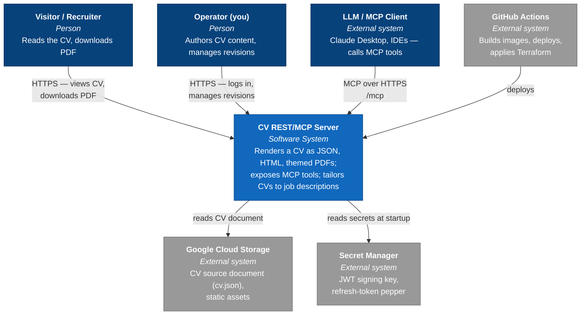
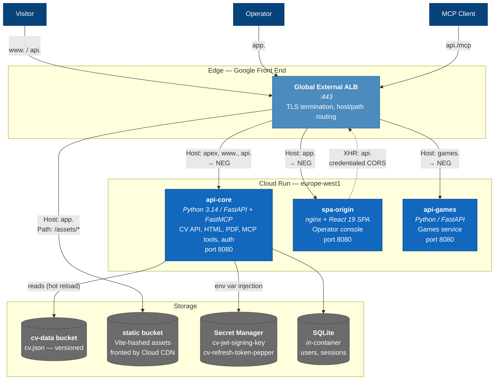
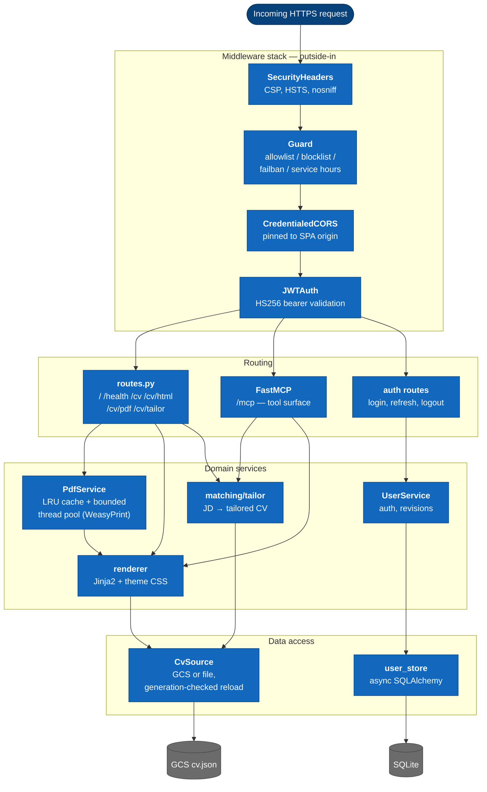
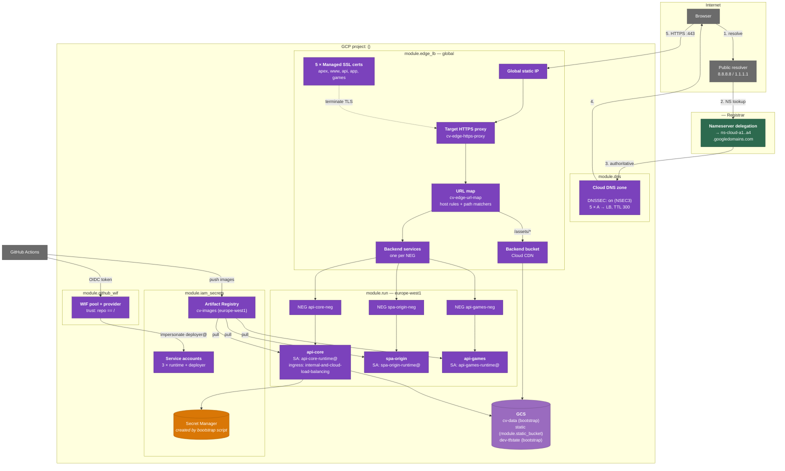
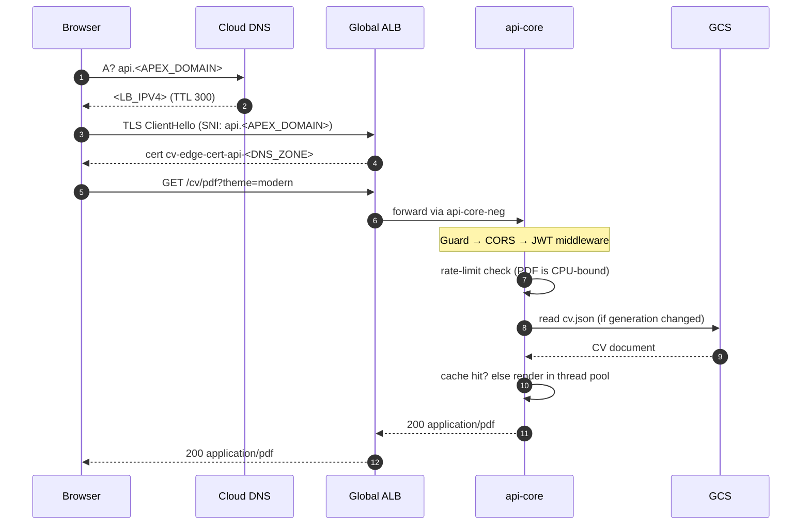
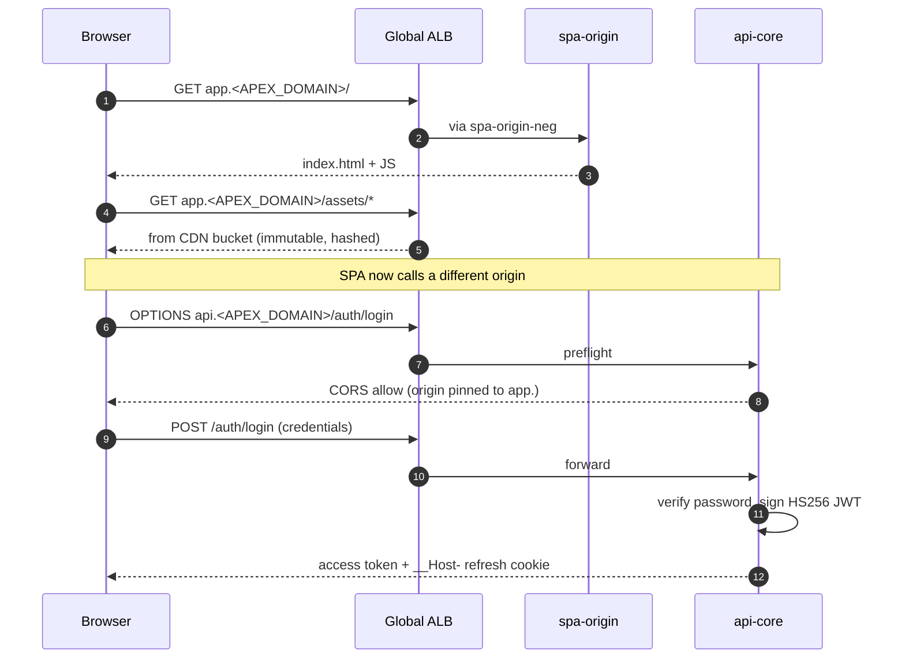
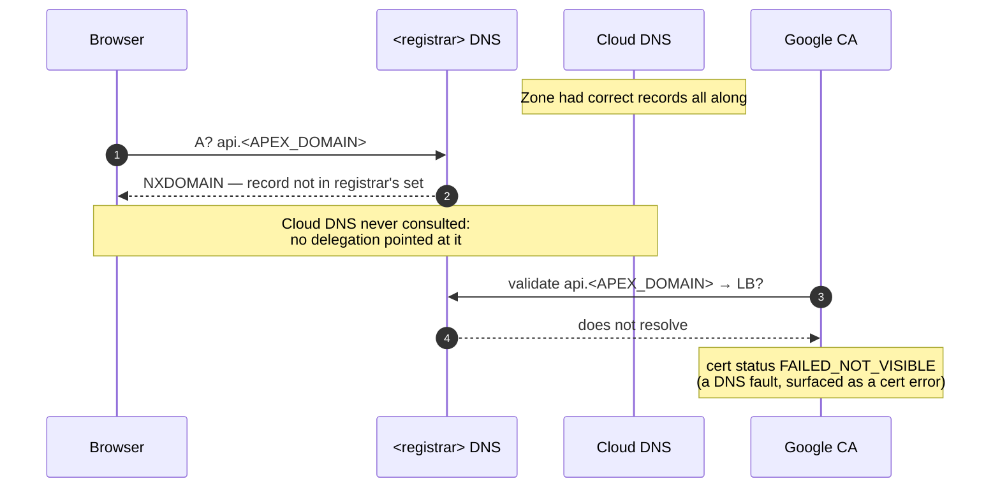
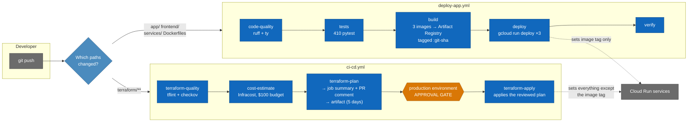

# Architecture Diagrams (C4)

> **Sanitized copy.** Real project IDs, IPs, domains, and service-account names
> are replaced with `<PLACEHOLDERS>`. The operator's full-detail counterpart is
> `.agent/architecture-diagrams_local.md` (gitignored). **Edit both together** —
> see [AGENTS.md](../AGENTS.md#paired-documentation).

Visual model of the system, following the [C4 model](https://c4model.com/):
each level zooms in one step further.

| Level | Question it answers | Section |
| --- | --- | --- |
| 1. System Context | Who uses it, what does it talk to? | [↓](#1-system-context) |
| 2. Container | What are the deployable pieces? | [↓](#2-containers) |
| 3. Component | What is inside `api-core`? | [↓](#3-components-api-core) |
| — Deployment | Where does it physically run? | [↓](#4-deployment--gcp-infrastructure) |
| — Dynamic | How does a request flow? | [↓](#5-request-flows) |
| — CI/CD | How does code get there? | [↓](#6-cicd-pipelines) |

Concepts behind these (DNS, certificates, NEGs, ingress) are explained in
[infrastructure.md](infrastructure.md). Application internals are in
[architecture.md](architecture.md).

**Live values are recorded in [§7 Reference Data](#7-reference-data).** When
infrastructure changes, update that table and any diagram labels that repeat it.

---

## 1. System Context

Who and what the system interacts with.

---

## 2. Containers

The deployable units. Each box is a separately built and released artifact.

> **Note the dotted line.** The SPA is served from `app.` but calls the API at
> `api.` — a cross-origin request. This is why `api-core` runs credentialed CORS
> pinned to the SPA origin, and why the refresh cookie is host-prefixed.

---

## 3. Components (api-core)

Inside the `api-core` container. Middleware runs **outside-in**: the first
listed is outermost and sees the request first.

---

## 4. Deployment — GCP Infrastructure

Physical placement, and which Terraform module owns each resource.

**Legend** — 🟣 purple = Terraform-managed · 🟠 orange = created by
`scripts/deploy-cloud-run.sh` (bootstrap) · 🟪 mixed = some of each · 🟢 green =
outside GCP.

---

## 5. Request Flows

### 5.1 Visitor requests a themed PDF

### 5.2 Operator logs into the SPA (cross-origin)

### 5.3 What failed before DNS delegation

Recording the failure mode, since it was non-obvious:

---

## 6. CI/CD Pipelines

Two path-filtered workflows enforcing: **Terraform owns the platform, the app
pipeline owns the released artifact.**

The dotted lines are the crux: both pipelines write to the same Cloud Run
services but own **disjoint fields**. `lifecycle { ignore_changes = [image] }`
in `modules/cloud_run_service` is what keeps them from reverting each other.

---

## 7. Reference Data

Live values. Verify with the commands in the last column.

### Network

| Item | Value | Verify |
| --- | --- | --- |
| GCP project | `<PROJECT_ID>` (number `<PROJECT_NUMBER>`) | `gcloud config get-value project` |
| Region | `europe-west1` | — |
| Load balancer IPv4 | `<LB_IPV4>` | `terraform output load_balancer_ipv4` |
| Apex domain | `<APEX_DOMAIN>` | — |
| Registrar | registrar | — |
| DNS host | Cloud DNS, zone `<DNS_ZONE>` | `gcloud dns managed-zones list` |
| Nameservers | `ns-cloud-a1..a4.googledomains.com` | `terraform output nameservers` |
| Record TTL | 300s | `gcloud dns record-sets list --zone=<DNS_ZONE>` |
| DNSSEC | signing on (NSEC3); DS record **not yet published** | `gcloud dns dns-keys list --zone=<DNS_ZONE>` |

### Hostname routing

| Hostname | Workload | Notes |
| --- | --- | --- |
| `<APEX_DOMAIN>` | `api-core` | apex |
| `www.<APEX_DOMAIN>` | `api-core` | |
| `api.<APEX_DOMAIN>` | `api-core` | REST + `/mcp` |
| `app.<APEX_DOMAIN>` | `spa-origin` | `/assets/*` → CDN bucket |
| `games.<APEX_DOMAIN>` | `api-games` | |

### Cloud Run services

| Service | Dockerfile | Runtime SA | Port | Ingress |
| --- | --- | --- | --- | --- |
| `api-core` | `Dockerfile` | `api-core-runtime@…` | 8080 | internal-and-cloud-load-balancing |
| `spa-origin` | `frontend/Dockerfile` | `spa-origin-runtime@…` | 8080 | internal-and-cloud-load-balancing |
| `api-games` | `services/games/Dockerfile` | `api-games-runtime@…` | 8080 | internal-and-cloud-load-balancing |

Direct `*.run.app` URLs return **404 by design** — the ingress setting requires
traffic to arrive via the load balancer.

### Images and identity

| Item | Value |
| --- | --- |
| Artifact Registry | `europe-west1-docker.pkg.dev/<PROJECT_ID>/cv-images` |
| Image tag scheme | `<service>:<short-git-sha>` plus `:latest` |
| CI deployer SA | `deployer@<PROJECT_ID>.iam.gserviceaccount.com` |
| WIF provider | `projects/<PROJECT_NUMBER>/locations/global/workloadIdentityPools/github/providers/gh-actions` |
| WIF trust condition | `assertion.repository == '<GITHUB_OWNER>/<REPO>'` |
| Terraform state | `gs://<PROJECT_ID>-dev-tfstate`, prefix `terraform/state` |

> The `GCP_DEPLOY_SA` GitHub secret **must** name `deployer@`. Two older
> deployer accounts (`<PROJECT_ID>-deployer@`, `cv-ivanprytula-deployer@`)
> still exist unmanaged — see [infrastructure.md §7](infrastructure.md#7-identity-how-ci-talks-to-gcp-without-keys).

### Terraform modules

| Module | Owns |
| --- | --- |
| `gcp_apis` | API enablement (all but `cloudresourcemanager`) |
| `iam_secrets` | Service accounts, IAM bindings, Artifact Registry |
| `github_wif` | WIF pool, OIDC provider, impersonation bindings |
| `cloud_run_service` | One Cloud Run service + its serverless NEG |
| `edge_lb` | Global IP, SSL certs, URL map, proxy, backends |
| `dns` | Managed zone + A records |
| `static_bucket` | CDN origin bucket |
| `uploads` | Private user-content bucket (**currently disabled**) |
| `cloud_armor` | Edge rate limiting (**currently disabled**) |
| `org_policies` | Project guardrails (**currently disabled**) |

---

## Editing these diagrams

Mermaid renders natively on GitHub and in most IDEs. To iterate quickly, paste a
block into the [Mermaid Live Editor](https://mermaid.live).

Conventions used here:

- `flowchart TB` for structure, `sequenceDiagram` for flows
- `classDef` for consistent colouring; purple = Terraform-managed
- ` ` for line breaks inside labels
- Dotted arrows (`-.->`) for indirect or cross-origin relationships

When infrastructure changes, update **§7 first** — it is the single place values
are recorded — then any diagram labels repeating them.
